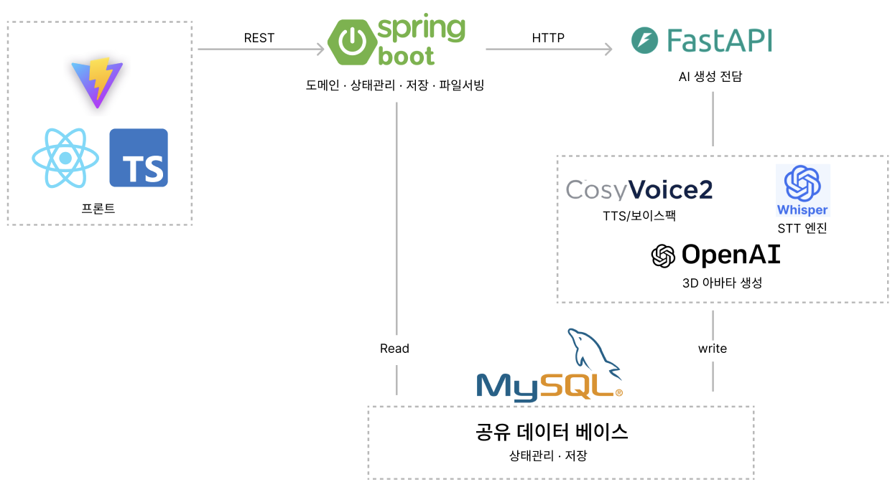

<div align="center">


# Familog

**가족의 얼굴과 목소리로, 시니어에게 일상을 읽어주는 AI 패밀리 커뮤니케이션 플랫폼**

*"시니어는 읽지 않는다. 본다, 그리고 듣는다."*


</div>

---

## 배포 URL

| 구분 | URL |
|------|-----|
| 서비스 (프론트) | https://fe-gamma-pink.vercel.app |
| API 서버 | https://34-64-132-201.sslip.io |
| API 문서 (Swagger) | https://34-64-132-201.sslip.io/swagger-ui/index.html |

---

## 팀원

| 역할 | 이름 |
|------|------|
| 팀장 | 김주은 |
| 기획 | 이정훈, 최성균 |
| UI/UX | 유여은 |
| FE | 김동건, 한정현 |
| BE | 남건오, 윤성욱 |

## 서비스 소개

### 문제

스마트폰과 SNS는 이미 가족 소통의 기본 창구지만, 시니어에게는 벽이 높습니다.

- 글자가 작고, 알림이 무엇을 의미하는지 이해하기 어렵다
- 조작이 낯설어 가족이 올린 소식을 **"읽는 것" 자체가 부담**이다
- 결국 가족 대화에서 소외되고, 정서적 고립이 깊어진다

### 해법

**"읽기 → 듣기", "텍스트 → 가족의 얼굴·목소리"** 로 바꾸면 시니어의 참여 장벽은 급격히 낮아집니다.

> 가족이 사진·소식을 올리면, 그 사람의 **3D 캐릭터 아바타**와 **본인 목소리(보이스팩)** 로 시니어에게 **읽어주고**, 시니어는 **말로 답장**하는 서비스.

### 4대 핵심 기능

| 기능 | 설명 | 기술 |
|------|------|------|
| **가족 3D 아바타** | 가입 시 올린 사진을 3D풍 캐릭터로 변환 — 누가 올렸는지 글이 아닌 **얼굴**로 인지 | OpenAI 이미지 API |
| **개인 보이스팩** | 지정 문장 한 번 낭독으로 그 사람의 목소리를 재현하는 보이스팩 생성 | CosyVoice2 Zero-shot 클로닝 |
| **보이스 읽어주기 (TTS)** | 메시지가 올라오면 작성자의 보이스팩으로 자동 낭독 — 시니어는 **듣기만** | CosyVoice2 로컬 추론 |
| **음성 답장 (STT)** | 시니어가 말로 녹음하면 텍스트로 변환해 가족에게 전달 — 시니어는 **말만** | OpenAI Whisper 로컬 추론 |

### 사용자 경험

**가족 (발신자)** — 그룹 생성/초대코드 참여 → 사진 촬영(아바타 생성) → 문장 낭독(보이스팩 생성) → 일상 공유

**시니어 (수신자)** — 홈의 큰 아바타 카드를 탭 → 가족 목소리로 소식 자동 낭독 → 마이크 버튼으로 말로 답장

---

## 데모 화면

<!-- TODO: 데모 캡처 이미지를 docs/images/ 에 넣고 경로를 맞춰주세요 -->

| 온보딩 · 아바타 생성 | 홈 (아바타 그리드) | 채팅 · 음성 낭독 | 갤러리 |
|:---:|:---:|:---:|:---:|
|  |  |  |  |

---

## 시스템 아키텍처



**설계 포인트**

- **서버 2개 분리** — Spring 서버는 도메인·상태·저장을 담당하는 *관리자*, FastAPI 서버는 무상태 *AI 생성 공장*. 생성 기능은 Python 생태계가 필수라 역할을 명확히 나눴습니다.
- **비동기 생성 패턴** — 아바타·보이스팩 생성은 수 초~수십 초 소요. 요청 즉시 `PENDING`으로 응답하고 `@Async` 백그라운드에서 `PROCESSING → READY/FAILED`로 전이, 프론트는 상태 폴링으로 완료를 감지합니다. (시니어 서비스에서 화면 프리징은 치명적)
- **로컬 추론 지향** — TTS/STT는 오픈소스 모델을 GPU VM에서 직접 서빙(무료), 아바타만 외부 API 사용.

---

## 기술 스택

| 영역 | 스택 |
|------|------|
| **Frontend** | React 19 · TypeScript · Vite 8 · Tailwind CSS 4 · React Router 7 |
| **Backend** | Java 17 · Spring Boot · Spring Data JPA · MySQL · springdoc-openapi (Swagger) |
| **AI** | Python 3.11 · FastAPI · PyTorch · **CosyVoice2-0.5B** (Zero-shot TTS) · **openai-whisper** (STT) · OpenAI 이미지 API (아바타) |
| **Infra** | GCP GPU VM (g2-standard-4, L4 · 서울 리전) · systemd · Vercel (FE) |

---

## API 명세

전체 명세: [docs/03_API_SPEC.md](docs/03_API_SPEC.md) · 상세 스키마: Swagger UI (`/swagger-ui`)

| 도메인 | Method | Path | 설명 |
|--------|--------|------|------|
| Group | `POST` | `/api/groups` | 가족 그룹 생성 (초대코드 발급) |
| | `GET` | `/api/groups/{groupId}` | 그룹 조회 |
| Member | `POST` | `/api/members` | 초대코드로 가입 |
| | `POST` | `/api/members/{id}/avatar` | 사진 업로드 → 3D 아바타 비동기 생성 |
| | `POST` | `/api/members/{id}/voicepack` | 낭독 음성 업로드 → 보이스팩 비동기 생성 |
| | `GET` | `/api/members/{id}` | 멤버 단건 (생성 상태 폴링) |
| | `GET` | `/api/members` | 멤버 목록 (홈 아바타 그리드) |
| | `PATCH` | `/api/members/{id}` | 프로필 수정 |
| Message | `POST` | `/api/messages` | 텍스트 메시지 (보이스팩 TTS 자동 생성) |
| | `POST` | `/api/messages/voice` | 음성 메시지 (STT 자동 변환) |
| | `POST` | `/api/messages/image` | 이미지 메시지 |
| | `GET` | `/api/messages` | 메시지 목록 (증분 폴링) |
| | `POST` | `/api/messages/read` | 읽음 처리 |
| Photo | `POST` | `/api/photos` | 갤러리 사진 업로드 |
| | `GET` | `/api/photos` | 갤러리 목록 (날짜 필터) |
| File | `GET` | `/files/**` | 생성된 아바타·음성 등 정적 파일 서빙 |

---

## 기술 문서

| 문서 | 내용 |
|------|------|
| [01_PROJECT_OVERVIEW](docs/01_PROJECT_OVERVIEW.md) | 서비스 기획 — 문제 정의, 핵심 가설, 4대 기능, 기대 효과 |
| [02_TECH_FLOW](docs/02_TECH_FLOW.md) | 기술 플로우 — 비동기 생성 패턴, AI 서버 계약, 기술 결정 기록 |
| [03_API_SPEC](docs/03_API_SPEC.md) | API 전체 지도 (server + ai) |
| [04_CONVENTIONS](docs/04_CONVENTIONS.md) | 협업 규칙 — 커밋 포맷, 브랜치 전략, 명명 규칙 |
| [05_ARCHITECTURE](docs/05_ARCHITECTURE.md) | 시스템 아키텍처 — 책임 분리, 패키지 구조, 비동기 처리 |
| [06_ERD](docs/06_ERD.md) | 데이터 모델 — 테이블 정의, 상태 enum |
| [07_DEPLOY](docs/07_DEPLOY.md) | GCP GPU VM 배포 — systemd, 재배포 스크립트, 체크리스트 |

---

## 실행 방법

### 저장소 구성

```
familog/
├── fe/                # 프론트엔드 (React + Vite)
├── familog-server/    # 백엔드 (Spring Boot) ← 현재 저장소
└── familog-ai/        # AI 서버 (FastAPI)
```

### 1. AI 서버 (familog-ai)

```bash
# Python 3.11 필수
python3.11 -m venv .venv && source .venv/bin/activate
pip install -r requirements.txt

# CosyVoice2 모델 다운로드 (~2GB)
HF_HUB_ENABLE_HF_TRANSFER=1 hf download FunAudioLLM/CosyVoice2-0.5B \
  --local-dir pretrained_models/CosyVoice2-0.5B

cp .env.example .env   # OPENAI_API_KEY 설정
uvicorn main:app --port 8000
```

### 2. 백엔드 (familog-server)

```bash
# MySQL에 familog 데이터베이스 생성 후
./gradlew bootRun      # :8080, Swagger: /swagger-ui
```

### 3. 프론트엔드 (fe)

```bash
# Node.js 22 필수
npm install
npm run dev            # :5173, /api → localhost:8080 프록시
```
